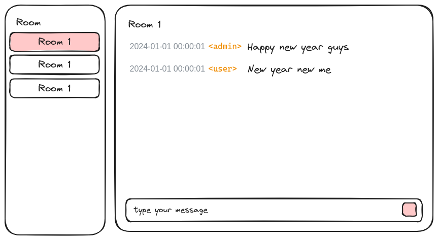

# Simple Chat

## Description

Create chat app with websocket

- user join a room chat
- user can send message
- user can receive message

## Goal

- Exercise skill to handle websocket connection

## Simple User Story

> As a user
>
> I can initiate/send message to another user
>
> So the another user can receive my message

## Advanced User Story

> As a user
>
> I can provide my credential
>
> So I can login as user account

> As a user
>
> I can create a chat room
>
> So I can have a new chat room

> As a user
>
> I can provide a room id
>
> So I can join the chat room

> As a user
>
> I can send message in the chat room
>
> So my message appear in the chat room

> As a user
>
> I can leave a chat room
>
> So that chat room does not appear in my account

## Related

UI Suggestion

